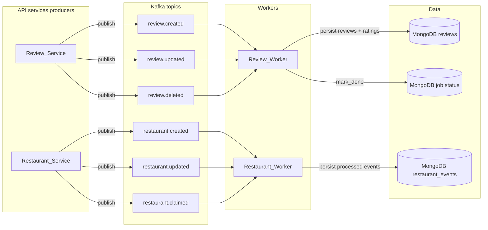

# Lab 2 — Kafka producer / consumer (reviews)

```mermaid
flowchart LR
  subgraph producers [API services producers]
    ReviewAPI[Review_Service]
    RestaurantAPI[Restaurant_Service]
  end
  subgraph kafka [Kafka topics]
    T1[review.created]
    T2[review.updated]
    T3[review.deleted]
    T4[restaurant.created]
    T5[restaurant.updated]
    T6[restaurant.claimed]
  end
  subgraph consumers [Workers]
    RW[Review_Worker]
    RSW[Restaurant_Worker]
  end
  subgraph data [Data]
    MongoReviews[(MongoDB reviews)]
    MongoJobs[(MongoDB job status)]
    MongoEvents[(MongoDB restaurant_events)]
  end
  ReviewAPI -->|publish| T1
  ReviewAPI -->|publish| T2
  ReviewAPI -->|publish| T3
  RestaurantAPI -->|publish| T4
  RestaurantAPI -->|publish| T5
  RestaurantAPI -->|publish| T6
  T1 --> RW
  T2 --> RW
  T3 --> RW
  T4 --> RSW
  T5 --> RSW
  T6 --> RSW
  RW -->|persist reviews + ratings| MongoReviews
  RW -->|mark_done| MongoJobs
  RSW -->|persist processed events| MongoEvents
```

Extended topics from assignment like `user.created`, `user.updated`, and `booking.status` follow the same producer -> topic -> worker pattern.
