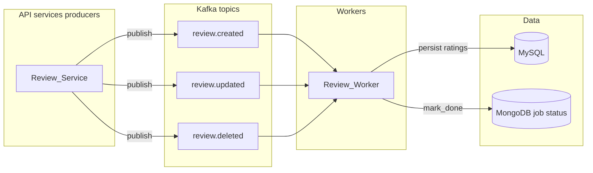

# Lab 2 — Kafka producer / consumer (reviews)

Extended diagram (optional topics from assignment): `restaurant.created`, `user.created`, etc., follow the same pattern with dedicated worker services.
